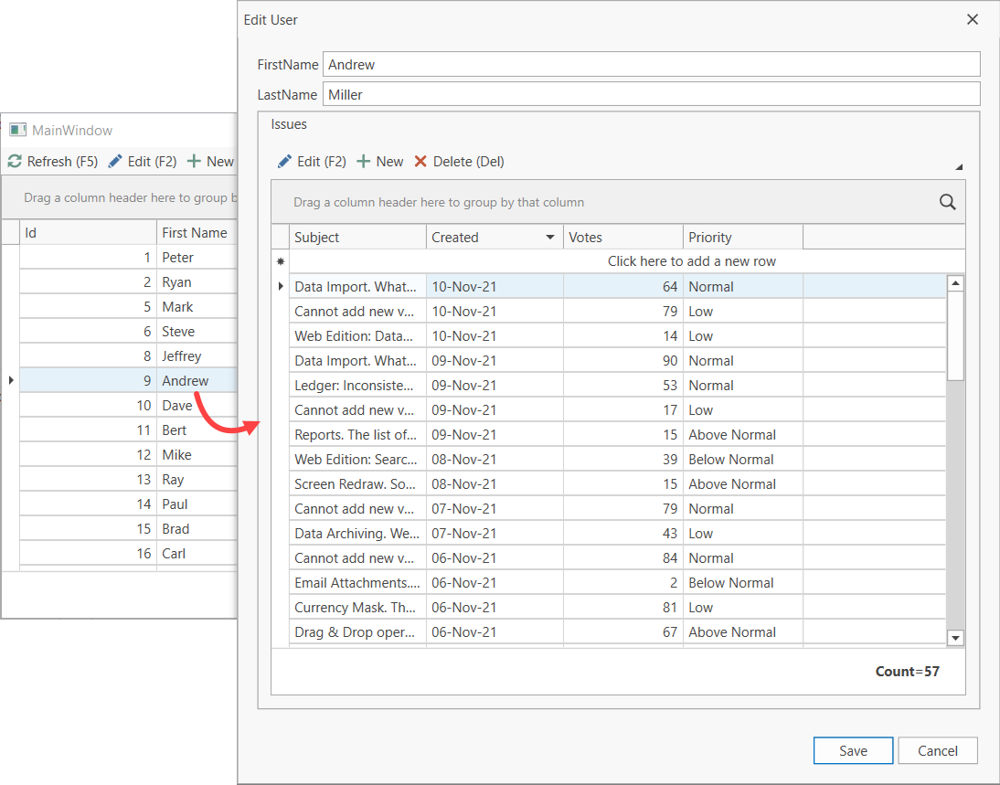

<!-- default badges list -->
[](https://supportcenter.devexpress.com/ticket/details/T1044263)
[](https://docs.devexpress.com/GeneralInformation/403183)
<!-- default badges end -->
# WPF Data Grid - Extend CRUD Operations

After you bind the Data Grid to a database, you can implement CRUD operations (create, read, update, delete). These operations allow you to post changes that users make in the Data Grid to the database.

This repository contains solutions that extend CRUD operations:

* [Undo Operations](#undo-operations)
* [Async CRUD Operations](#async-crud-operations)
* [Detail Collection Editing](#detail-collection-editing)


## Solution 1 - Undo Operations

This solution uses the **UndoCRUDOperationsBehavior** that allows users to undo the latest operation (create, update, or delete).

1. Assign this behavior to the Data Grid's view.
2. Create a class that implements **ICopyOperationsSupporter**. The class instance allows the behavior to copy data item properties and apply them when users execute the undo operation.

    ```xaml
    <dxg:GridControl x:Name="grid" ItemsSource="{Binding ItemsSource}">
        <dxg:GridControl.View>
            <dxg:TableView>
                <!-- ... -->
                <dxmvvm:Interaction.Behaviors>
                    <local:UndoCRUDOperationsBehavior x:Name="undoBehavior" 
                        CopyOperationsSupporter="{Binding CopyOperationsSupporter}" />
                </dxmvvm:Interaction.Behaviors>
            </dxg:TableView>
        </dxg:GridControl.View>
    </dxg:GridControl>
    ```

    ```cs
    public interface ICopyOperationSupporter {
        object Clone(object item);
        void CopyTo(object source, object target);
    }
    ```

3. Allow users to call the behavior's **UndoCommand**.

    ```xml
    <dxb:BarButtonItem Content="Undo (Ctrl+Z)" Command="{Binding UndoCommand, ElementName=undoBehavior}"/>
    ```

### Files to Look At

* [MainWindow.xaml](./CS/Undo/MainWindow.xaml)
* [MainViewModel.cs](./CS/Undo/MainViewModel.cs)
* [UserCopyOperationSupporter.cs](./CS/Undo/UserCopyOperationSupporter.cs)


## Solution 2 - Async CRUD Operations

This solution shows how to implement async CRUD operations:

1. Create tasks that allow the Data Grid to work with the database asynchronously.
2. Assign these tasks to the [DataSourceRefreshArgs.RefreshAsync](https://docs.devexpress.com/CoreLibraries/DevExpress.Mvvm.Xpf.DataSourceRefreshArgs.RefreshAsync), [ValidationArgs.ResultAsync](https://docs.devexpress.com/CoreLibraries/DevExpress.Mvvm.Xpf.ValidationArgs.ResultAsync), [DeleteValidationArgs.ResultAsync](https://docs.devexpress.com/CoreLibraries/DevExpress.Mvvm.Xpf.DeleteValidationArgs.ResultAsync) properties.

```cs
args.ResultAsync = Task.Run(async () => { await DoSomethingAsync(); });
```

Note that you also need to load initial data asynchronously. Use the [EventToCommand](https://docs.devexpress.com/WPF/DevExpress.Mvvm.UI.EventToCommand) behavior to execute the [RefreshDataSource](https://docs.devexpress.com/WPF/DevExpress.Xpf.Grid.DataViewCommandsBase.RefreshDataSource) command in response to the **Loaded** event:

```xaml
<dxg:GridControl ItemsSource="{Binding ItemsSource}">
    <dxmvvm:Interaction.Behaviors>
        <dxmvvm:EventToCommand Event="Loaded" 
                               Command="{Binding RelativeSource={RelativeSource Self}, 
                                                 Path=AssociatedObject.View.Commands.RefreshDataSource}"/>
    </dxmvvm:Interaction.Behaviors>
    <!-- ... -->
</dxg:GridControl>
```

### Files to Look At

* [MainWindow.xaml](./CS/AsyncCRUDOperations/MainWindow.xaml)
* [MainViewModel.cs](./CS/AsyncCRUDOperations/MainViewModel.cs)


## Solution 3 - Detail Collection Editing

The solution uses the [DialogEditFormBehavior](https://docs.devexpress.com/WPF/DevExpress.Xpf.Grid.DialogEditFormBehavior) with a custom [EditTemplate](https://docs.devexpress.com/WPF/DevExpress.Xpf.Grid.DialogEditFormBehavior.EditTemplate) that allows users to edit detail data for each row in the Data Grid.



### Files to Look At

* [MainWindow.xaml](./CS/DetailCollectionEditing/MainWindow.xaml)
* [MainViewModel.cs](./CS/DetailCollectionEditing/MainViewModel.cs)


## Documentation

* [Bind to Data](https://docs.devexpress.com/WPF/7352/controls-and-libraries/data-grid/bind-to-data)
* [CRUD Operations](https://docs.devexpress.com/WPF/401907/controls-and-libraries/data-grid/crud-operations)

## More Examples

* [Bind the WPF Data Grid to Data](https://github.com/DevExpress-Examples/how-to-bind-wpf-grid-to-data)
* [Implement CRUD Operations in the WPF Data Grid](https://github.com/DevExpress-Examples/how-to-implement-crud-operations)
